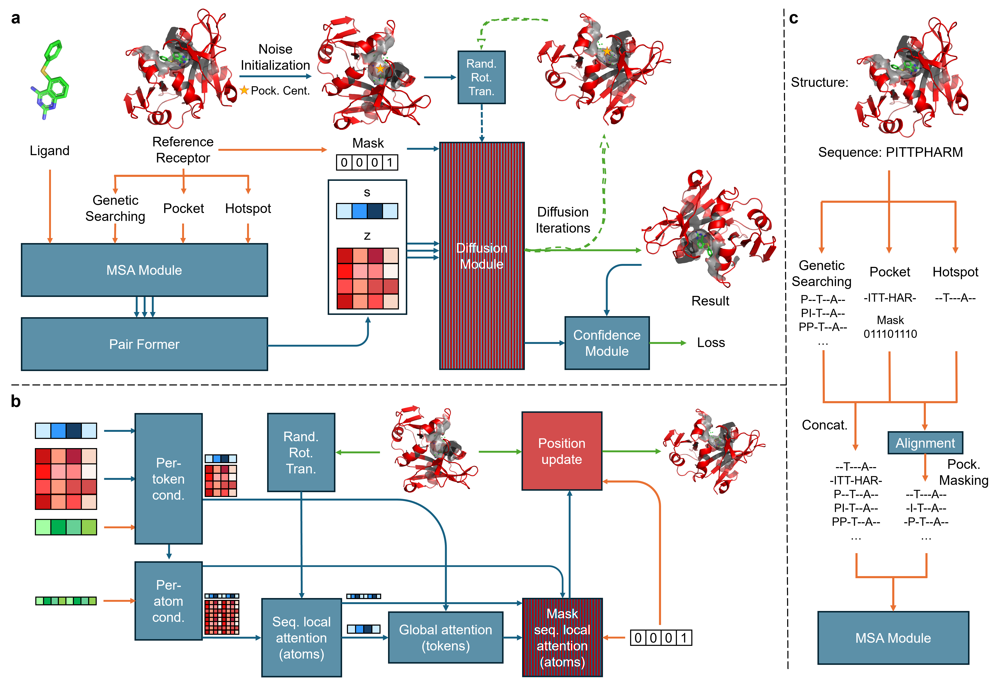
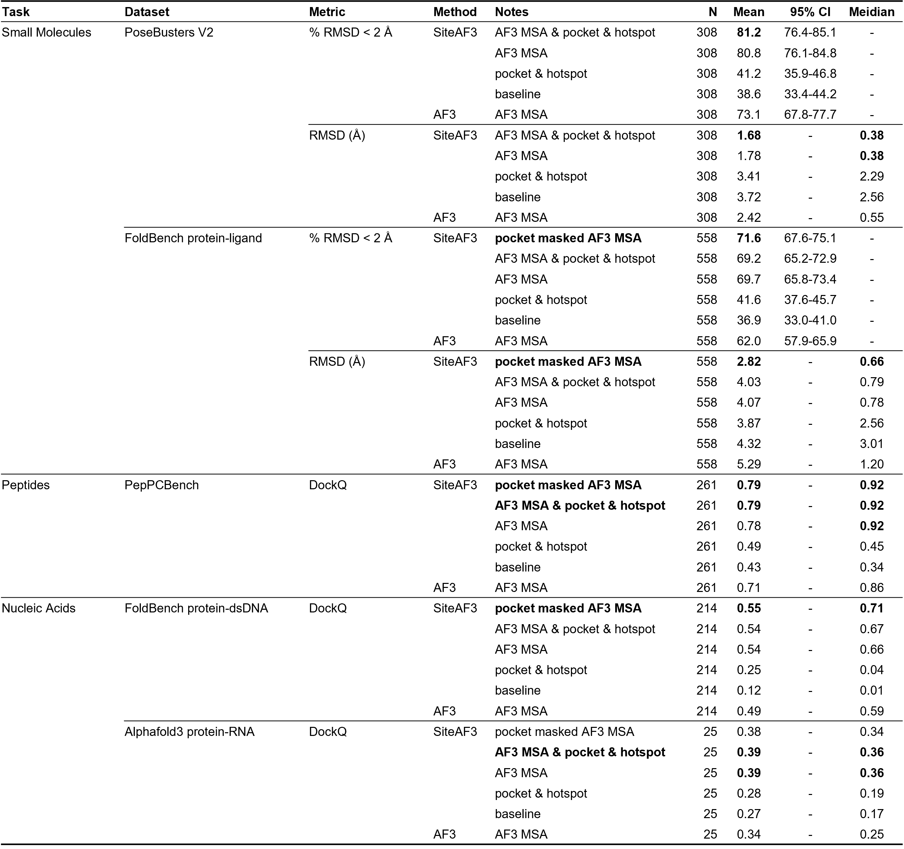

# SiteAF3: Accurate Site-specific Folding via Conditional Diffusion Based on Alphafold3

[](https://github.com/your-repo/SiteAF3)
[](https://python.org)
[](LICENSE)

## Introduction

SiteAF3 is a universal molecular interaction analysis platform based on AlphaFold3, supporting structure prediction and analysis for various receptor-ligand type combinations.


## Core Features

### 🎯 Supported Molecule Types

**Receptor Types:**
- `protein`: Protein

**Ligand Types:**
- `protein`: Protein
- `nucleic`: Nucleic acid (DNA/RNA)
- `small_molecule`: Small molecule ligand / ions

### 📊 Supported Molecule Combinations

| Receptor Type | Ligand Type    | Example Usage                                 |
|---------------|----------------|-----------------------------------------------|
| protein       | nucleic        | Protein-RNA/DNA complex                       |
| protein       | small_molecule | Protein-drug complex                          |
| protein       | protein        | Protein-peptide interaction                   |
| nucleic       | small_molecule | Nucleic acid-small molecule (not tested)      |

### 🔧 Main Tools

1. **Hotspot structure generation** (`generate_hotspot.py`)
2. **Pocket structure generation** (`generate_pocket.py`)
3. **Inference scripts** (`run_SiteAF3.py`)

## Installation

### Dependencies

Replace /PATH/TO/alphafold3/src/alphafold3/model/model.py with ./AF3_code/model.py before intalling AlphaFold3.

```bash
# Installing AlphaFold3 dependencies
# Please follow the official AlphaFold3 documentation for installation
conda activate your_AF3_env_name
conda env update --file environment.yml
```

## Quick Start

### 1. Generate hotspot and pocket files

You can use the scripts here, or you can use PyMOL to build your own files.  
```bash
python generate_hotspot.py \
    --input_pdb /PATH/TO/pdb_file \
    --receptor_type protein \
    --receptor_chains A B (OPTIONAL) \
    --ligand_type nucleic \
    --ligand_chains C (OPTIONAL) \

python generate_pocket.py \
    --input_pdb /PATH/TO/pdb_file \
    --receptor_type protein \
    --receptor_chains (OPTIONAL) \
    --ligand_type small_molecule \
    --ligand_chains (OPTIONAL) \
    --hotspot_cutoff 8.0 \
    --pocket_cutoff 10.0
```

### 2. View chain information

```bash
python generate_hotspot.py --input_pdb input.pdb --list_chains
```

### 3. Structure prediction

Hotspot files are required if enabling **--use_hotspot_msa_for_embedding**

```bash
python run_SiteAF3.py \
    --config_file /PATH/TO/JSON_file \
    --output_dir /PATH/TO/output_dir \
    --use_pocket_msa_for_embedding (OPTIONAL) \
    --use_hotspot_msa_for_embedding (OPTIONAL) \
    --use_af3_msa (OPTIONAL)\
    --verbose
```

### SiteAF3 Main Program Configuration

In the JSON configuration file for `run_SiteAF3.py`,
See more JSON cases in `test_input` folder.

```json
{
    "name": "my_complex",
    "receptor": [{
        "rec_struct_path": "input.pdb",
        "fixed_chain_id": ["A", "B"],
        "hotspot_path": "/PATH/TO/input_hotspot.pdb",
        "pocket_path": "/PATH/TO/input_pocket.pdb"
    }],
    "ligand": [{
        "type": "rna",
        "chain_id": "C",
        "sequence": "..."
    }],
    "modelSeeds": [42, 123, 456]
}
```

## Advanced Features

### Intelligent Chain Classification

The program automatically detects chain types based on:
1. **Atom check**: Search for characteristic atoms (CA atoms→protein, P atoms→nucleic acid)
2. **Residue ratio**: Count ratio of standard amino acids and nucleic acid residues
3. **Small molecule identification**: Exclude water molecules and ions, identify ligand molecules
4. **Atom count**: Small molecules typically have 1-200 heavy atoms
5. **Element composition**: Molecules containing non-standard elements

### Representative Atom Selection

Automatically selects based on molecule type:
- **Protein**: CA atoms
- **Nucleic acid**: P atoms or C4' atoms  
- **Small molecule**: Geometric center

## Output Files

### File Structure

```
output_dir/
├── seed_{1}
│   ├── confidences.json
│   ├── summary_confidences.cif
│   ├── info.json
│   ├── model.cif
│   ├── ranking_scores.csv
│   ├── sample_{0}
│   │   │── model.cif
│   │   ├── confidences.json
│   │   ├── summary_confidences.cif
│   ├── sample_{1}           
│   └── ......      
├── seed_{2} 
└── ......  
```

## Testing and Validation

### Result summary

Prediction accuracy across biomolecular complexes


## Troubleshooting

Use the `--verbose` parameter to get detailed debugging information.

### Version 1.0.0 - Universal Molecule Type Support

**Features:**
- 🎯 Support for multiple receptor-ligand combinations
- 🔧 Compatible to Alphafold3
- 🧬 Intelligent molecular recognition system
- 📁 Flexible configuration system
- 🛠️ Parallel processing support

## Contributing

Issues and Pull Requests are welcome!

## License

This project is licensed under the MIT License - see the [LICENSE](LICENSE) file for details.

## Citation

If you use SiteAF3 in your research, please cite:

```bibtex
@article{Abramson2024,
  author  = {Haocheng, Tang and Junmei, Wang},
  journal = {},
  title   = {Accurate Site-specific Folding via Conditional Diffusion Based on Alphafold3},
  year    = {2025},
  volume  = {},
  number  = {},
  pages   = {},
  doi     = {}
}

@misc{doi:10.1101/2025.07.06.663385,
	doi = {10.1101/2025.07.06.663385},
	publisher = {Cold Spring Harbor Laboratory},
	title = {Accurate Site-specific Folding via Conditional Diffusion Based on Alphafold3},
	author = {Tang, Haocheng and Wang, Junmei},
	note = {[Online; accessed 2025-07-10]},
	date = {2025-07-10},
	year = {2025},
	month = {7},
	day = {10},
}

@software{siteaf3,
  title={SiteAF3: Universal Molecular Interaction Analysis Platform},
  author={Haocheng Tang},
  year={2025},
  url={https://github.com/HaCTang/SiteAF3}
}
```

--- 
